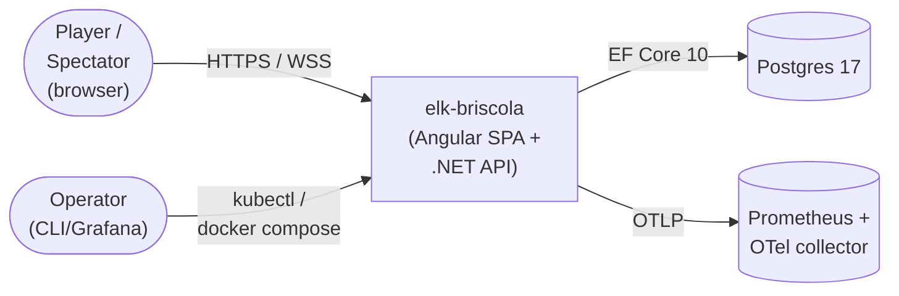
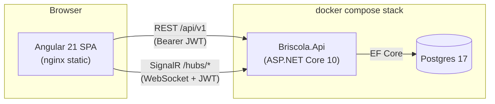
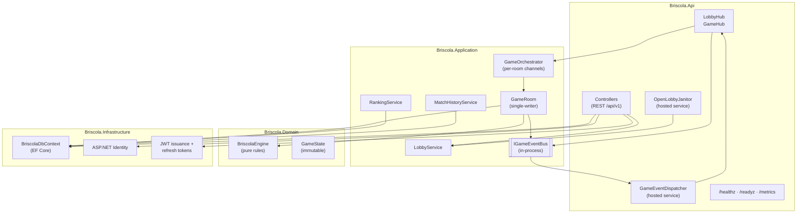
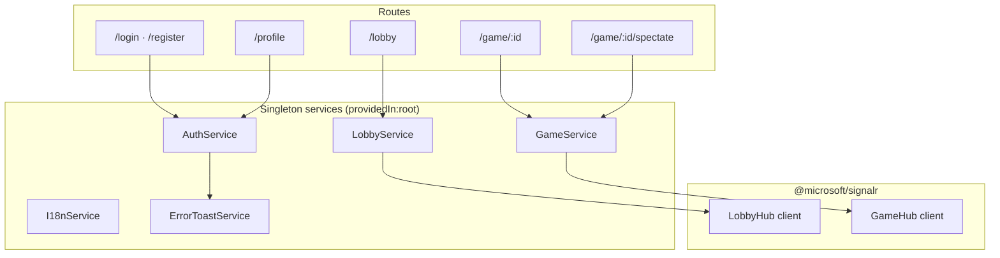

# Architecture

C4-style overview of elk-briscola. Diagrams render in any Mermaid-aware viewer (GitHub renders them inline). See [README.md § High-level architecture](../README.md#high-level-architecture) for the headline summary; this document focuses on the boundaries and on the *why* behind each one.

---

## Level 1 — System context

A single deployable system serves the SPA (nginx-baked) and exposes a REST + SignalR API. State persistence is Postgres; observability is Prometheus/OTel. No external integrations in v1 — no email provider, no payments, no auth federation.

---

## Level 2 — Containers

- **`frontend` container** — multi-stage Dockerfile that builds the Angular workspace and bakes the output into nginx. The nginx config reverse-proxies `/api/*` and `/hubs/*` to the backend so the SPA only needs `:8080`. Static card-set assets are served from the API.
- **`api` container** — ASP.NET Core 10 host. Boots the `Briscola.*` projects, runs EF Core migrations on startup, exposes REST + SignalR. The orchestrator process is single-instance for v1 (see [ADR 0002](adr/0002-server-authoritative-game-state.md) — once written).
- **`postgres` container** — pinned to 17-alpine. Volumes are bind-mounted from `pgdata/`. The integration test suite spins up an ephemeral 17 image via Testcontainers; production-shape stack uses the same image.

---

## Level 3 — API components

Key invariants:

- **Single-writer per room.** Each `GameRoom` owns a `Channel<GameCommand>`; commands are processed sequentially. The orchestrator never mutates `_state` from the outside.
- **Hub layer is dumb.** Controllers + hubs translate transport ↔ application; all gameplay decisions live in `Briscola.Application` (orchestration) and `Briscola.Domain` (rules).
- **Snapshots are derived per recipient.** `GameRoom.SnapshotForUser(userId)` filters down `_state` to what that user is allowed to see (own hand, others as counts only). Spectators get the `Guid.Empty` variant.
- **Event bus is in-process.** `IGameEventBus` is a `Channel<IGameEvent>` consumed by `GameEventDispatcher`, which maps events to SignalR pushes. Out-of-process scaling (Redis backplane, sharded rooms) is v2; today the dispatcher and the rooms must share an AppDomain.

---

## Level 3 — Frontend components

- **`LobbyService` is eager-instantiated in the App component.** Its constructor effects (auto-connect on auth, capture pending-game, auto-route on `gameStarted`) need to be live regardless of route — otherwise a creator who navigated to `/profile` never gets the auto-route push.
- **State derivation is signal-based.** Both `pendingGame` and `currentRunningGame` are computed from the `openGames` / `runningGames` lists × the authenticated user's id × per-seat `seatPlayers`. The state survives a hard refresh because the open/running list is re-fetched on every `connect()`.
- **The game table is rendered from a single `RedactedStateForUser` snapshot.** Every push lands on `stateSig`; computed signals (`mySeatIndex`, `opponentSlots`, `activeForfeitDeadline`, …) derive the UI from there. The only mutation outside `stateSig` is the latched `mySeatIndex` heuristic for clients that don't get `MySeatIndex` server-side.

---

## Data layer

| Concern | Choice | Rationale |
|---|---|---|
| Persistence | Postgres 17 (prod), SQLite (test) | EF Core abstracts both; integration suite uses Testcontainers against real Postgres. |
| Schema migrations | Per-provider migration assemblies | `Briscola.Infrastructure.Postgres.Migrations` + `Briscola.Infrastructure.Sqlite.Migrations`. Migration drift is caught by a schema-parity test. |
| Game persistence | Snapshot-per-move (`GameRecord.StateSnapshotJson`) | See [ADR 0005 — snapshot store, not event sourcing]. Replay would require the full move log, which is captured separately in `GameMoves` for future use. |
| Auth | ASP.NET Core Identity + JWT | Identity owns user storage; JWT issuance/refresh is hand-rolled (see Step 3.5). Refresh tokens single-use, rotated on every refresh. |

---

## Cross-cutting concerns

- **Observability.** Structured Serilog logs (per-request `CorrelationId` from `X-Correlation-ID` header), Prometheus metrics at `/metrics`, OpenTelemetry traces via OTLP when `OTEL_EXPORTER_OTLP_ENDPOINT` is set. See [docs/deployment.md § Observability](deployment.md).
- **Security.** Per-recipient redaction at the snapshot boundary; server-authoritative validation in the engine; rate limits on `PlayCard` (1/sec) and `SendChat` (5/10s); refresh-token reuse triggers chain revocation. See [docs/security.md](security.md).
- **Card sets.** Pluggable: drop a manifest + assets under `wwwroot/card-sets/{id}/` and they appear in `GET /card-sets`. No SPA rebuild. See [docs/card-sets.md](card-sets.md).

---

## Out-of-scope (today)

- Horizontal scale (multi-instance orchestrator with a shared message bus).
- Push notifications / mobile native shells.
- Replay viewer (the data is captured; UI is v2).
- Bots / single-player mode.

See [TODO.md § Out of scope for v1](../TODO.md#out-of-scope-for-v1) for the full list.
